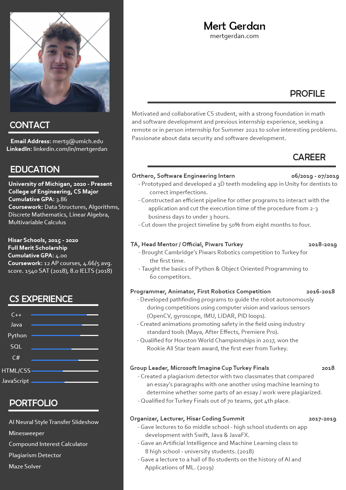

**Hey there, I have compiled a list of my personal projects:**
- [Artistic Neural Style Slideshow (ANSS)](https://github.com/hisarcs/neural-style-transfer)
- [Super Minesweeper with JavaFX](https://github.com/mertgerdan/personal-projects/tree/minesweeper)
- [Compound Interest and Inflation Calculator](https://github.com/mertgerdan/personal-projects/tree/compinterestcalc)
- [Plagiarism Detector](https://github.com/mertgerdan/personal-projects/tree/plagiarismdetector)
- [Maze Solver](https://github.com/mertgerdan/personal-projects/tree/cs-p-project)

You can access them by visiting my [personal projects](https://github.com/mertgerdan/personal-projects) github repository.

_Mert_
